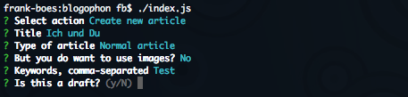

 Blogophon
=========

A small and simple [Static Site Generator](https://davidwalsh.name/introduction-static-site-generators) for blogs. A live example of this blog generator can be found at [3960! Journal](http://journal.3960.org).

**Features:**

* Generate static HTML files from Markdown files.
* Simple and fast templating via Mustache.
* Generate all required teaser pages.
* Generate all required tag pages.
* Scale images and implement them responsively.
* Puts all relevant meta stuff into `<head>` for SEO and social sharing.
* Publish files to remote server.
* A ton of [special features](docs/special-features.md) like ATOM, RSS, AMP, etc.

Installation
------------

1. Make sure you have [Node.js](https://nodejs.org/) installed by calling `node -v`.
1. Clone this repository to your webserver.
1. Run `npm install` to install all dependencies.
1. Run `npm start` or [`node index.js`](index.js) to start the configuration dialog.
1. Set your web server's document root folder to `htdocs` of this project (as there will be the HTML files generated by the Blogophon Generator).

How it works
------------

Almost all stuff you will be doing with the Blogophon is done via command line. Just call `npm start` or [`node index.js`](index.js) (which results in the same task being called), so you will not need any manual at all.

Articles are written in [Markdown with some extra features](docs/markdown.md).

Version
-------

Version: [0.6.0](https://github.com/fboes/blogophon/releases) (2016-11-02)

Legal stuff
-----------

Author: [Frank Boës](http://3960.org)

Copyright & license: See [LICENSE.txt](LICENSE.txt)
